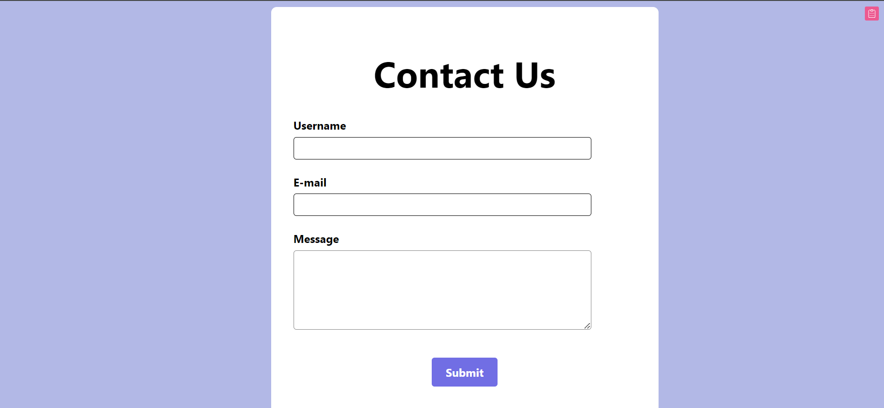

# Contact Form

This is a simple contact form built with React and `react-hook-form` for managing form state and validation. It includes a DevTool from `@hookform/devtools` for debugging form state.

## Features

- Form validation for username, email, and message fields.
- Custom error messages for required fields and email pattern validation.
- Alert notification on successful form submission.
- Responsive design with custom styling.
## Screenshots

### Main Interface


### Succesful Submission


### Invalid Email Format


### Empty Username


### Empty Email


### Empty Message


## Installation

1. Clone the repository:
   ```sh
   git clone https://github.com/your-username/your-repository.git
   
2. Navigate to the project directory:
   ```sh
   cd your-repository

3. Install the dependencies:
   ```sh
   npm install
